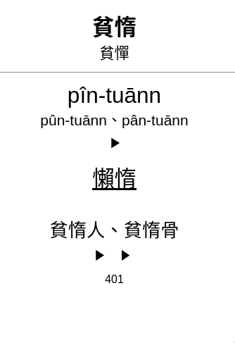
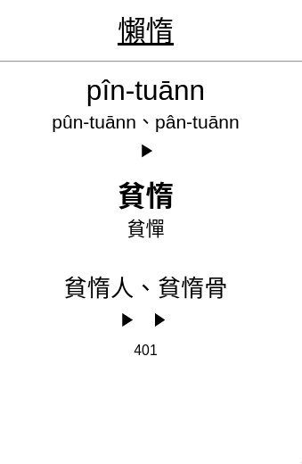
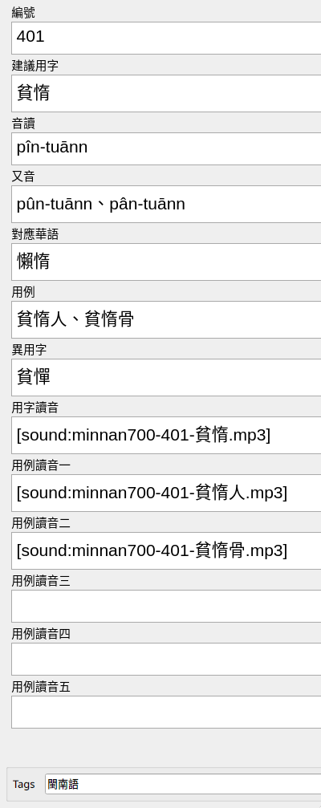

# 臺灣閩南語推薦用字700字表

[AnkiWeb - 臺灣閩南語推薦用字700字表](https://ankiweb.net/shared/info/1891161765)

- 從[臺灣閩南語推薦用字700字表](https://ws.moe.edu.tw/001/Upload/userfiles/file/iongji/700iongji_1031222.pdf)
  提取資料生成csv（by Tabula）
- 從[臺灣教育部閩南語推薦700字音檔](http://prj.digimagic.com.tw/ntcmin700/index.htm)提取錄音並逐字逐例切割音頻
- 生成 Anki 卡片組

## Anki卡組

Anki 卡片有兩款：Recognition（由閩南語認華語）和 Recall（由華語記憶閩南語）。閩南語和對應華語分別用粗體和下劃線區分。

Recognition：正面閩南語建議用字（異用字）；反面音讀（又音）、對應華語、例子、編號。

Recall：正面對應華語；反面音讀（又音）、閩南語建議用字（異體字）、例子、編號。

fields一覽：

## 特別處理

因字庫無對應字體，149建議用字被拆開，506使用異體字代替原本的建議用字。

## 資源說明（For Developers）

- `700iongji_107.05.03.pdf`: 臺灣閩南語推薦用字 700 字表【 PDF 版】
- `700iongji.csv`: 從 PDF 版中由 Tabula 提取的 csv 用字文檔
- `anki_csv.csv`: 導入 Anki 卡組的 csv 源文檔
- `audio_splits.tar.gz`: 逐字逐例 mp3 存檔，共 2125 份文件
- `臺灣閩南語推薦用字700字表.apkg`: Anki 卡組文檔，可直接下載導入 Anki
- `labels/all_labels.txt`: Audacity 使用的 label 文檔，由 [Silence Finder](https://manual.audacityteam.org/man/silence_finder_setting_parameters.html)生成後微調
- `labels/computed_labels.txt`: 使用`all_labels.txt`及`700iongji.csv`生成正確的 label，用於輸出最終 mp3 檔

## 更新记录

- 2021-08-29：修正了數張卡片音頻錯位的問題[PR#2](https://github.com/yiufung/minnan-700/pull/2) (Thanks to @Ka-lip)
- 2022-01-30：更新了 AnkiWeb 上的版本

---

> 你著佇少年的日，記念創造你的主，就是患難的日猶未到，也你所講，我無通佇伊快樂，
> 許個年猶未近的時。 -- 傳道書 第12章1節
